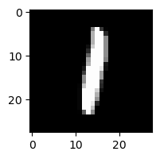
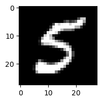
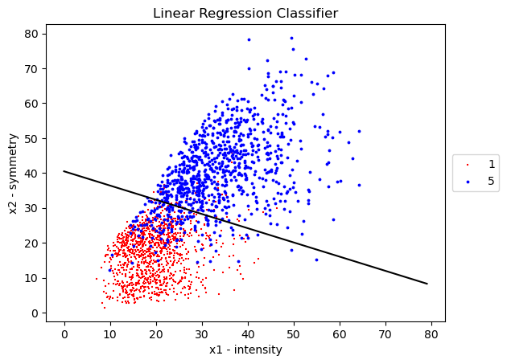
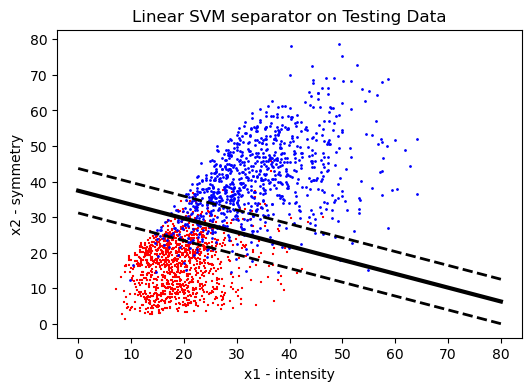

# Classifying MNIST Dataset

## Introduction

Through this project, I use different methods to recognize and segregate the MNIST Digits --> 1 and 5. Three methods are implemented to perform this classification. They are as follows:

1) Linear Regression
2) Support Vector Machine
3) Neural Network

## MNIST Dataset

The MNIST dataset contains 60,000 training images of handwritten digits from zero to nine and 10,000 images for testing. So, the MNIST dataset has 10 different classes. For the following project we only use 2 classes: 1 and 5.

The handwritten digits images are represented as a 28×28 matrix where each cell contains grayscale pixel value. An example of each of the digits can be seen in the table below:

Digit 1  |  Digit 5 
:-------------------------:|:-------------------------:
 |  

## Results

Linear Regression | Support Vector Machine
:-------------------------:|:-------------------------:
 |  
